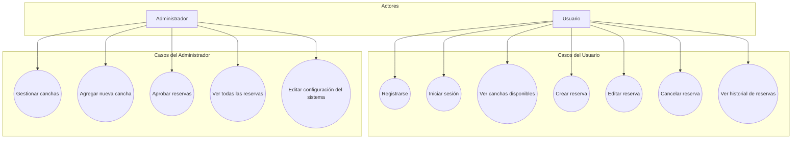
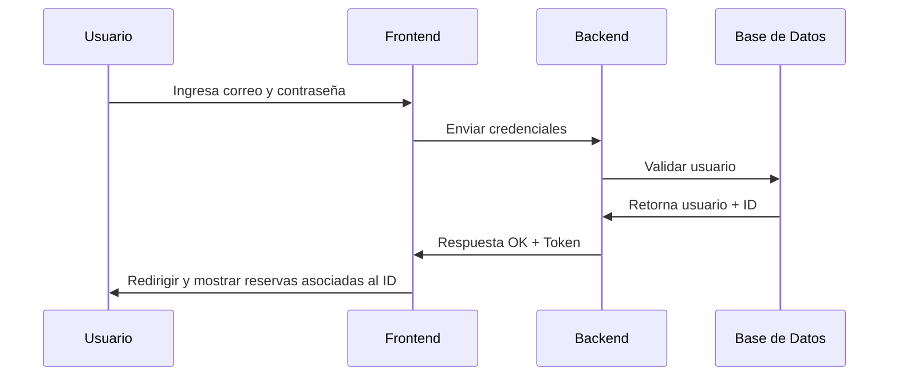
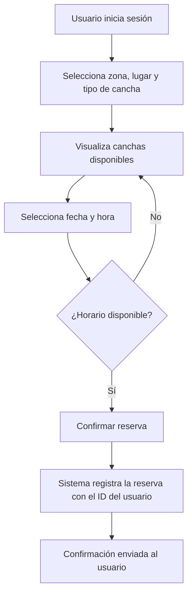

# Proyecto SportMatch - Sistema de Reserva de Canchas

> **Proyecto de Ingeniería de Software** - Sistema web completo para la reserva y gestión de canchas deportivas con roles de usuario y administrador.

---

##  Tabla de Contenidos

1. [Visión General](#visión-general)
2. [Documentación de Lógica de Negocio](#documentación-de-lógica-de-negocio)
3. [Documentación de Procesos](#documentación-de-procesos)
4. [Documentación de Dominio](#documentación-de-dominio)
5. [Stack Tecnológico](#stack-tecnológico)
6. [Estructura del Proyecto](#estructura-del-proyecto)
7. [Instalación y Ejecución](#instalación-y-ejecución)
8. [Flujos Principales](#flujos-principales)

---

##  Visión General

SportMatch es un sistema integral de reserva de canchas deportivas que permite a los usuarios:
- Registrarse e iniciar sesión
- Explorar canchas disponibles en diferentes zonas y ubicaciones
- Realizar reservas para fechas y horarios específicos
- Gestionar sus reservaciones

Los administradores pueden:
- Gestionar el catálogo de canchas
- Visualizar todas las reservaciones
- Administrar usuarios del sistema
- Configurar disponibilidades

---

##  Documentación de Lógica de Negocio

### 1. Diagramas UML

#### 1.1 Diagrama de Casos de Uso
Actores principales y sus interacciones con el sistema:



**Descripción de actores:**
- **Usuario**: Cliente autenticado que realiza reservas de canchas deportivas, consulta disponibilidad, edita y cancela sus reservas, y visualiza su historial.
- **Administrador**: Gestor del sistema responsable de mantener el catálogo de canchas, gestionar usuarios, supervisar todas las reservaciones y configurar parámetros del sistema.

#### 1.2 Diagrama de Secuencia - Flujo de Autenticación
Interacción entre componentes durante el proceso de login:



**Flujo de mensajes:**
- El usuario ingresa credenciales en el formulario
- Frontend envía credenciales al backend
- Backend valida contra la base de datos
- Si es válido, retorna token de sesión e información del usuario
- Frontend almacena token y redirige según el rol

#### 1.3 Diagrama de Actividad - Proceso de Reserva
Flujo de trabajo para crear una reserva:



**Estados del proceso:**
1. Autenticación del usuario
2. Navegación por filtros (zona, lugar, tipo)
3. Visualización de disponibilidad
4. Selección de fecha y hora
5. Validación de disponibilidad
6. Confirmación y registro

### 2. Reglas de Negocio Documentadas

| Regla | Descripción |
|-------|-------------|
| **RN-001: Límite de Reservas Activas** | Un usuario solo puede tener máximo 3 préstamos activos simultáneamente |
| **RN-002: Cancelación de Reserva** | Las reservas pueden cancelarse hasta 24 horas antes de la fecha programada |
| **RN-003: Validación de Disponibilidad** | No se permite sobrelap de horarios para la misma cancha |
| **RN-004: Usuarios Verificados** | Solo usuarios con email verificado pueden crear reservas |
| **RN-005: Rol Administrativo** | Solo administradores pueden crear nuevas canchas y modificar configuración |
| **RN-006: Historiales de Auditoría** | Todas las operaciones críticas quedan registradas con timestamp |

### 3. Matriz de Validaciones

| Entidad | Campo | Validación | Regla |
|---------|-------|-----------|-------|
| Usuario | Email | Formato válido + Único en BD | RN-004 |
| Usuario | Contraseña | Mín 8 caracteres, caracteres especiales | Seguridad |
| Cancha | Nombre | No vacío, único por zona | RN-005 |
| Cancha | Capacidad | Número positivo mayor a 0 | Lógica |
| Reserva | Fecha | Debe ser futura | RN-003 |
| Reserva | Horario | No debe traslapar | RN-003 |
| Reserva | Usuario | Máximo 3 activas | RN-001 |

---

## Documentación de Procesos

### 1. Diagramas de Flujo - Procesos Clave

#### 1.1 Proceso de Autenticación y Autorización

```
INICIO
  ↓
[Capturar credenciales]
  ↓
[Validar formato email]
  ├─ ¿Válido?
  │  ├─ NO → [Mostrar error de formato]
  │  │        ↓
  │  │     [Retorna a login]
  │  ├─ SÍ → [Consultar BD por email]
  │          ↓
  │      [¿Existe usuario?]
  │      ├─ NO → [Mostrar: Usuario no registrado]
  │      ├─ SÍ → [Validar contraseña (bcrypt)]
  │              ├─ ¿Contraseña correcta?
  │              │  ├─ NO → [Incrementar intentos fallidos]
  │              │  │        [¿Intentos > 5?]
  │              │  │        ├─ SÍ → [Bloquear cuenta]
  │              │  │        ├─ NO → [Mostrar: Contraseña incorrecta]
  │              │  ├─ SÍ → [Generar JWT Token]
  │              │           [Obtener rol del usuario]
  │              │           [Crear sesión]
  │              │           [Retornar token + datos usuario]
  │              │           ↓
  │              │       [Redireccionar según rol]
  │              │       ├─ ADMIN → [Dashboard Admin]
  │              │       ├─ USUARIO → [Home + Mis Reservas]
FIN
```

#### 1.2 Proceso de Creación de Reserva

```
INICIO
  ↓
[Usuario autenticado inicia flujo de reserva]
  ↓
[Filtrar por ZONA]
  ↓
[Filtrar por LUGAR dentro de zona]
  ↓
[Filtrar por TIPO DE CANCHA]
  ↓
[Listar canchas disponibles]
  ↓
[Usuario selecciona cancha]
  ↓
[Mostrar calendario con fechas disponibles]
  ↓
[Usuario selecciona FECHA]
  ↓
[Mostrar HORARIOS disponibles para esa fecha]
  ↓
[Usuario selecciona HORARIO]
  ↓
[Validar:]
  ├─ ¿Usuario tiene < 3 reservas activas?
  ├─ ¿Horario no está reservado?
  ├─ ¿Fecha es futura?
  │
  └─ Si NO cumple → [Mostrar error específico] → [Retorna a selección]
    └─ Si SÍ cumple →
       ↓
       [Crear registro RESERVA en BD]
       ↓
       [Guardar: usuario_id, cancha_id, fecha, horario_inicio, horario_fin, estado='ACTIVA']
       ↓
       [Generar confirmación]
       ↓
       [Enviar email de confirmación]
       ↓
       [Redirigir a "Mis Reservas"]
       ↓
FIN
```

### 2. BPMN (Business Process Model and Notation) - Procesos Formales

**Proceso Nivel 1: Gestión de Ciclo de Vida de Reserva**

```
RESERVA: CREADA → CONFIRMADA → ACTIVA → COMPLETADA
                  ↑                ↓
                  └────CANCELADA←──┘
```

**Proceso Nivel 2: Aprobación de Reserva (Admin)**

```
INICIO → [Revisar solicitud] → {¿Validar disponibilidad?}
                                 ├─ Rechazada → [Notificar usuario]
                                 └─ Aprobada → [Confirmar reserva]
                                               → [Notificar usuario]
                                               → FIN
```

### 3. Algoritmos Complejos Documentados

#### 3.1 Algoritmo de Disponibilidad de Horarios

```
FUNCIÓN buscar_horarios_disponibles(cancha_id, fecha):
  horarios_sistema = [08:00-09:00, 09:00-10:00, ..., 21:00-22:00]  // Rango 8 AM - 10 PM
  reservas_existentes = CONSULTAR BD WHERE cancha_id = cancha_id AND fecha = fecha
  
  Para cada horario en horarios_sistema:
    SI (horario NO está en reservas_existentes):
      AGREGAR horario a horarios_disponibles
    FIN SI
  FIN PARA
  
  RETORNAR horarios_disponibles
FIN FUNCIÓN
```

#### 3.2 Algoritmo de Validación de Solapamiento

```
FUNCIÓN validar_sin_solapamiento(cancha_id, fecha, hora_inicio, hora_fin):
  reservas_conflictivas = CONSULTAR BD WHERE
    cancha_id = cancha_id AND 
    fecha = fecha AND 
    (hora_inicio < hora_fin_existente) AND 
    (hora_fin > hora_inicio_existente)
  
  SI (COUNT(reservas_conflictivas) > 0):
    RETORNAR FALSO  // Hay solapamiento
  SINO:
    RETORNAR VERDADERO  // Sin conflicto
  FIN SI
FIN FUNCIÓN
```

---

##  Documentación de Dominio

### 1. Glosario de Términos (Vocabulario Ubiquo)

| Término | Definición | Sinónimos |
|---------|-----------|-----------|
| **Cancha** | Espacio físico habilitado para práctica deportiva | Pista, Terreno |
| **Reserva** | Asignación de una cancha a un usuario para fecha/hora específica | Booking, Préstamo |
| **Zona** | División geográfica que agrupa múltiples lugares | Región, Sector |
| **Lugar** | Establecimiento que contiene una o más canchas | Complejo, Centro |
| **Tipo de Cancha** | Categoría de cancha (Futsal, Tenis, Voleibol, etc.) | Deporte, Especialidad |
| **Horario** | Rango de tiempo específico dentro de un día | Bloque de tiempo, Slot |
| **Estado de Reserva** | Situación actual de una reserva (Activa, Cancelada, Completada) | Status, Condición |
| **Rol** | Función asignada a un usuario (Usuario, Administrador) | Perfil, Grupo |

### 2. User Stories Mapeadas a Funcionalidades

#### US-001: Registro de Nuevo Usuario
```
Como: Usuario no registrado
Quiero: Crear una cuenta en el sistema
Para: Poder acceder a realizar reservas

Criterios de aceptación:
✓ Formulario con campos: email, contraseña, nombre, teléfono
✓ Validación de email único
✓ Confirmación de email mediante enlace
✓ Contraseña con mínimo 8 caracteres
✓ Mensaje de confirmación al completar registro
```

#### US-002: Iniciar Sesión
```
Como: Usuario registrado
Quiero: Acceder al sistema con mis credenciales
Para: Ver mis reservas y crear nuevas

Criterios de aceptación:
✓ Formulario con email y contraseña
✓ Validación de credenciales
✓ Generación de token JWT
✓ Redirección según rol
✓ Recordar sesión por 7 días
```

#### US-003: Explorar Canchas Disponibles
```
Como: Usuario autenticado
Quiero: Buscar canchas por zona, lugar y tipo
Para: Encontrar la cancha que se ajuste a mis necesidades

Criterios de aceptación:
✓ Filtro dinámico por zona
✓ Sub-filtro por lugar dentro de zona
✓ Filtro por tipo de cancha
✓ Visualización de tarjetas con información básica
✓ Galería de imágenes por cancha
```

#### US-004: Crear Reserva
```
Como: Usuario autenticado
Quiero: Reservar una cancha para una fecha y hora específica
Para: Asegurar disponibilidad para jugar

Criterios de aceptación:
✓ Seleccionar cancha
✓ Calendarios muestran disponibilidad
✓ Selector visual de horarios
✓ Validar máximo 3 reservas activas
✓ Confirmación inmediata
✓ Email de confirmación
```

#### US-005: Gestionar Mis Reservas
```
Como: Usuario autenticado
Quiero: Ver, editar y cancelar mis reservas
Para: Tener control sobre mis bookings

Criterios de aceptación:
✓ Listado de reservas activas y pasadas
✓ Detalles completos por reserva
✓ Opción editar (si < 24 horas)
✓ Opción cancelar (si < 24 horas)
✓ Historial de reservas completadas
```

#### US-006: Administrar Canchas (Admin)
```
Como: Administrador
Quiero: Crear, editar y eliminar canchas
Para: Mantener el catálogo actualizado

Criterios de aceptación:
✓ Formulario de creación con todos los campos
✓ Listado con búsqueda y filtros
✓ Edición en línea o modal
✓ Eliminación lógica (no física)
✓ Validación de campos obligatorios
```

#### US-007: Visualizar Todas las Reservas (Admin)
```
Como: Administrador
Quiero: Ver todas las reservas del sistema
Para: Supervisar y aprobar reservaciones

Criterios de aceptación:
✓ Listado paginado de reservas
✓ Filtros por estado, usuario, cancha, fecha
✓ Búsqueda por usuario o referencia
✓ Cambio de estado manual
✓ Exportar a CSV (opcional)
```

### 3. Casos de Negocio / Escenarios Ejemplos

#### Escenario 1: Usuario Desea Reservar para Viernes por la Noche
```
Contexto:
- Día actual: miércoles 20 de nov, 15:00
- Usuario: Juan Pérez, ID: 12345
- Objetivo: Jugar futsal el viernes 22 de nov, 20:00-21:00

Pasos:
1. Juan inicia sesión con email y contraseña
2. Navega a "Ver Canchas"
3. Filtra por Zona: "Centro", Lugar: "Complejo Deportivo A", Tipo: "Futsal"
4. Ve 4 canchas disponibles con galerías de fotos
5. Selecciona "Futsal Court 1"
6. Abre calendario, selecciona viernes 22 de nov
7. Sistema muestra horarios disponibles: 19:00, 20:00, 21:00
8. Selecciona 20:00-21:00
9. Sistema valida:
   - ✓ Juan tiene 1 reserva activa (< 3)
   - ✓ Horario no está reservado
   - ✓ Fecha es futura
10. Sistema crea reserva y envía confirmación por email
11. Juan es redirigido a "Mis Reservas" donde ve la nueva reserva

Resultado: Reserva exitosa, confirmación enviada.
```

#### Escenario 2: Administrador Revisa Reservas del Día
```
Contexto:
- Usuario: Admin María García
- Acción: Revisión diaria de reservas

Pasos:
1. María accede al dashboard de admin
2. Va a "Ver Todas las Reservas"
3. Filtra por fecha = hoy
4. Ve 15 reservas en estado "ACTIVA"
5. Identifica una con error de doble booking (RN-003 violada)
6. Selecciona esa reserva y cambia estado a "CANCELADA"
7. Sistema notifica automáticamente al usuario
8. Sistema libera el horario para que otros lo reserver

Resultado: Conflicto resuelto, usuario notificado.
```

---

##  Stack Tecnológico

### Frontend
- **React 19** - Framework UI
- **Vite** - Bundler y dev server
- **React Router DOM v7** - Enrutamiento
- **TailwindCSS + DaisyUI** - Estilos y componentes
- **Axios** - Cliente HTTP
- **React Icons** - Librería de iconos
- **Date-fns + React DatePicker** - Manejo de fechas

### Backend (Esperado)
- Tecnología no especificada en documentación actual
- Debe exponer API REST con autenticación JWT
- Base de datos relacional (SQL)

### DevTools
- **ESLint** - Linting de código
- **Vite** - Build optimizado
- **PostCSS + Autoprefixer** - Procesamiento CSS

---

##  Estructura del Proyecto

```
Proyecto-Ingenieria-de-Software/
├── pnc-proyecto-final-frontend-ft-grupo-01-s02/
│   ├── src/
│   │   ├── assets/              # Recursos estáticos (imágenes)
│   │   ├── components/          # Componentes reutilizables
│   │   │   ├── BadgeEstado.jsx
│   │   │   ├── Button.jsx
│   │   │   ├── CalendarioReservas.jsx
│   │   │   ├── CardCancha.jsx
│   │   │   ├── CardReserva.jsx
│   │   │   ├── CardUsuarios.jsx
│   │   │   ├── Dropdown.jsx
│   │   │   ├── Footer.jsx
│   │   │   ├── Input.jsx
│   │   │   ├── NavBar.jsx
│   │   │   └── SelectorHoras.jsx
│   │   ├── config/              # Configuraciones
│   │   │   └── api.js           # Cliente HTTP y URL base
│   │   ├── context/             # Context API
│   │   │   └── AuthProvider.jsx # Proveedor de autenticación
│   │   ├── layouts/             # Layouts principales
│   │   │   ├── AuthLayout.jsx
│   │   │   └── MainLayout.jsx
│   │   ├── pages/               # Páginas por ruta
│   │   │   ├── Home.jsx
│   │   │   ├── InfoCanchitas.jsx
│   │   │   ├── InicioSesion.jsx
│   │   │   ├── Registro.jsx
│   │   │   ├── admin/           # Páginas de administrador
│   │   │   │   ├── AllReservaciones.jsx
│   │   │   │   ├── FormCancha.jsx
│   │   │   │   ├── ListadoCanchas.jsx
│   │   │   │   ├── ListadoReservas.jsx
│   │   │   │   ├── NewLugar.jsx
│   │   │   │   ├── UsuarioDetalle.jsx
│   │   │   │   ├── Usuarios.jsx
│   │   │   │   └── ViewLugar.jsx
│   │   │   └── usuario/         # Páginas de usuario
│   │   │       ├── FlujoReserva.jsx
│   │   │       ├── MisReservaciones.jsx
│   │   │       └── Reservacion.jsx
│   │   ├── routes/              # Configuración de rutas
│   │   │   ├── RutaProtegida.jsx
│   │   │   ├── RutaPublica.jsx
│   │   │   └── ScrollTop.jsx
│   │   ├── App.jsx              # Componente raíz
│   │   ├── main.jsx             # Entry point
│   │   └── index.css            # Estilos globales
│   ├── index.html
│   ├── package.json
│   ├── vite.config.js
│   ├── tailwind.config.js
│   └── eslint.config.js
├── documentacion.md             # Documentación técnica detallada
└── README.md                    # Este archivo
```

---

##  Instalación y Ejecución

### Requisitos Previos
- Node.js 18+ 
- npm o yarn
- Git

### Pasos de Instalación

1. **Clonar el repositorio**
   ```powershell
   git clone https://github.com/aacmyk22/Proyecto-Ingenieria-de-Software.git
   cd Proyecto-Ingenieria-de-Software
   ```

2. **Navegar a la carpeta del frontend**
   ```powershell
   cd pnc-proyecto-final-frontend-ft-grupo-01-s02
   ```

3. **Instalar dependencias**
   ```powershell
   npm install
   ```

4. **Configurar variables de entorno** (opcional)
   ```powershell
   # Crear archivo .env en la raíz del frontend
   # Agregar: VITE_API_URL=http://localhost:3000/api
   ```

5. **Ejecutar en desarrollo**
   ```powershell
   npm run dev
   ```
   La aplicación estará disponible en `http://localhost:5173`

### Scripts Disponibles

| Script | Comando | Descripción |
|--------|---------|-------------|
| Desarrollo | `npm run dev` | Inicia servidor Vite con hot-reload |
| Build | `npm run build` | Genera build optimizado para producción |
| Lint | `npm run lint` | Verifica calidad del código con ESLint |
| Preview | `npm run preview` | Sirve el build local para pruebas |

### Build para Producción

```powershell
npm run build
# Archivos generados en carpeta 'dist/'
# Subir contenido de dist/ a hosting (Netlify, Vercel, etc.)
```

---

## Flujos Principales del Sistema

### Flujo 1: Autenticación
**Estado Inicial:** Usuario no autenticado
**Estado Final:** Usuario autenticado con token y sesión activa

1. Usuario completa formulario de login
2. Frontend valida formato básico
3. Envía credenciales al backend
4. Backend valida en base de datos
5. Genera JWT token
6. Frontend almacena token en localStorage
7. Redirige según rol (Admin → Dashboard, Usuario → Home)

**Componentes Involucrados:**
- `InicioSesion.jsx` (página)
- `AuthProvider.jsx` (context)
- `Input.jsx`, `Button.jsx` (componentes)
- `/config/api.js` (cliente HTTP)

### Flujo 2: Búsqueda y Reserva de Cancha
**Estado Inicial:** Usuario autenticado sin reserva seleccionada
**Estado Final:** Reserva confirmada en el sistema

1. Usuario accede a "Ver Canchas" o "Flujo de Reserva"
2. Filtra por zona (dropdown)
3. Filtra por lugar (dropdown dinámico)
4. Filtra por tipo de cancha (dropdown dinámico)
5. Sistema lista canchas con imágenes y detalles
6. Usuario selecciona una cancha
7. `CalendarioReservas.jsx` muestra fechas disponibles
8. `SelectorHoras.jsx` muestra horarios disponibles
9. Usuario confirma selección
10. Sistema valida (máx 3 reservas, sin solapamiento)
11. Crea registro en BD
12. Muestra confirmación
13. Envía email
14. Redirige a "Mis Reservas"

**Componentes Involucrados:**
- `FlujoReserva.jsx` (orquestador)
- `Dropdown.jsx` (filtros)
- `CardCancha.jsx` (listado)
- `CalendarioReservas.jsx` (calendario)
- `SelectorHoras.jsx` (horarios)

### Flujo 3: Gestión de Reservas por Usuario
**Estado Inicial:** Usuario ve sus reservas
**Estado Final:** Reserva editada, cancelada o completada

1. Usuario accede a "Mis Reservaciones"
2. Sistema obtiene todas sus reservas (estado = ACTIVA)
3. Renderiza `CardReserva.jsx` para cada una
4. Usuario puede:
   - **Ver detalles:** Abre modal con información completa
   - **Editar:** Solo si faltan > 24 horas, abre formulario
   - **Cancelar:** Solo si faltan > 24 horas, solicita confirmación
5. Sistema actualiza BD y notifica

**Componentes Involucrados:**
- `MisReservaciones.jsx` (página principal)
- `CardReserva.jsx` (tarjeta por reserva)
- `BadgeEstado.jsx` (indicador de estado)

### Flujo 4: Gestión de Canchas (Admin)
**Estado Inicial:** Admin en panel administrativo
**Estado Final:** Cancha creada/editada/eliminada

1. Admin accede a "Listado de Canchas"
2. Sistema lista todas las canchas (paginado)
3. Admin puede:
   - **Crear:** Click en botón "Nueva Cancha", llena `FormCancha.jsx`
   - **Editar:** Click en icono edit, modifica en modal
   - **Eliminar:** Click en icono delete, solicita confirmación
4. `FormCancha.jsx` valida campos
5. Envía solicitud al backend
6. Sistema actualiza BD
7. Recarga listado con cambios

**Componentes Involucrados:**
- `ListadoCanchas.jsx` (página)
- `FormCancha.jsx` (formulario)
- `CardCancha.jsx` (tarjetas)
- `Button.jsx` (acciones)

---

##  Características Clave

 **Autenticación JWT** - Tokens seguros por sesión
 **Control de Roles** - Rutas protegidas para admin y usuario
 **Sistema de Filtros** - Búsqueda multi-nivel (zona → lugar → tipo)
 **Calendario Interactivo** - Selección visual de fechas
 **Validaciones de Negocio** - Máx 3 reservas, sin solapamiento
 **Responsive Design** - TailwindCSS + DaisyUI
 **Componentes Reutilizables** - Code splitting y maintainability
 **Manejo de Estados** - Context API para auth y datos globales

---

##  Seguridad

- Validación de email y contraseña en frontend y backend
- JWT para autenticación stateless
- Contraseñas hasheadas con bcrypt
- Rutas protegidas por rol
- Validación de disponibilidad (prevenir double-booking)
- CORS configurado para frontend específico

---

##  Referencias y Documentación Adicional

- `documentacion.md` - Documentación técnica detallada del frontend
- Diagrama de secuencia - Flujo de autenticación
- Diagrama de actividad - Proceso de reserva
- Diagrama de casos de uso - Funcionalidades del sistema

---

##  Roles del Proyecto

- **Usuario (CLIENTE)**: Puede crear, editar y cancelar reservas. Ver historial.
- **Administrador (ADMIN)**: Gestión completa de canchas, reservas y usuarios.

---

##  Notas Importantes

- El proyecto usa **React Router v7** para SPA (Single Page Application)
- Estilos con **TailwindCSS v4** y componentes de **DaisyUI v5**
- **Vite v6** como bundler moderno y rápido
- Context API para estado global (autenticación)
- API client centralizado en `/config/api.js`

---

##  Próximas Mejoras Sugeridas

1. Implementar **TypeScript** para mayor robustez de tipos
2. Agregar **tests unitarios** (Vitest) y **E2E** (Cypress/Playwright)
3. Integración continua con **GitHub Actions**
4. Documentación interactiva con **Storybook**
5. Notificaciones en tiempo real con **WebSockets**
6. Exportación de reportes (PDF/CSV)

---

**Última actualización:** Noviembre 2025  
**Rama:** `feature/Documentation`  
**Estado:** En desarrollo
